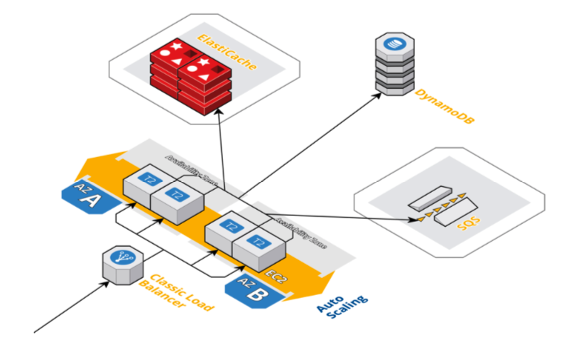

# Stock Symbol Service 

Service is responsible for CRUDing the information from the database, uploading the logo-images to SQS and retrieving the latest stock price from stock-price service. We upload images asynchronously via Amazon SQS and retrieve the stock-price synchronously.

